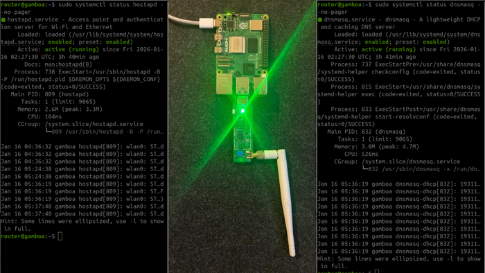

# Ubuntu Server 24.04 FPV Router / Repeater on Raspberry Pi 4
## Full SSH-only build guide with automatic interface detection and remembered upstream Wi-Fi networks




This guide gets you from:

**“Raspberry Pi 4 + blank microSD card + WiFi Dongle”**  
to  
**“Working Ubuntu-based FPV router/repeater that automatically brings up a robot network and shares internet from an upstream Wi-Fi through a USB Wi-Fi dongle.”**

This setup process avoids common failure types such as:

- cloud-init continuing to manage the AP-side interface
- the wrong interface winning the default route
- `hostapd` starting while the Pi's internal Wi-Fi is still being treated like a client
- DHCP working but NAT missing
- hand-editing interface names everywhere
- overwriting older upstream Wi-Fi credentials when adding a new one later

Everything below is written so the user can do the setup **entirely over SSH from a laptop**, without plugging the Pi into a monitor.

Additional repo docs:

- [Git Workflow](DOCS/git_workflow.md)

---

## Materials

You need:

- **1 Raspberry Pi 4**
- **1 microSD card** (32 GB or larger recommended)
- **1 USB Wi-Fi dongle** with stable Linux support
- **1 Raspberry Pi power supply**
- **1 laptop** that can connect over SSH
- Optional but recommended:
  - **high-endurance microSD card**
  - **UPS hat with batteries**

---

## 0. Flash Ubuntu Server onto the microSD card

Use the **official Raspberry Pi Imager**.

### 0.1 In Raspberry Pi Imager choose:

- **Device:** Raspberry Pi 4
- **Operating System:** Ubuntu Server 24.04 LTS (64-bit)
- **Storage:** your microSD card

### 0.2 Open the OS customization settings

When prompted, choose **Edit Settings**.

Set:
- **hostname**: choose the Linux hostname you want to use for this Pi
- **username**: choose the Linux username you want to use over SSH
- **password**: choose a password for that Linux user

Example only: you might choose a hostname like gamboa, a username like router, and a password like secure_password_DO_NOT_USE_THIS_ONE!.

Under **Configure Wireless LAN**, set the **initial upstream Wi-Fi** you want the Pi to use on first boot.

This is your internet source for setup, such as home or office Wi-Fi.

Set:
- **SSID**: your upstream Wi-Fi network name
- **Password**: your upstream Wi-Fi password

Example only: an upstream Wi-Fi could be called WorkshopWiFi24, with a matching password such as ExamplePassword123.

#### Services tab

Enable:
- **SSH**
- **Use password authentication**

Flash the card.

The first boot can take several minutes while Ubuntu expands the filesystem and finishes cloud-init, so give it a little time before scanning for it.

---

## 1. Before the first SSH connection, make sure the setup conditions are correct

This matters.

### 1.1 Put the microSD card into the Pi

### 1.2 Plug the USB Wi-Fi dongle into the Pi

### 1.3 Power on the Pi

### 1.4 Make sure your laptop and the Pi are on the same network

For the first SSH session, the Pi will use the Wi-Fi you configured in Raspberry Pi Imager, usually through the Pi's built-in Wi-Fi.

Your **laptop must be on that same network**.

The USB Wi-Fi dongle is switched into the permanent upstream WAN role later in this guide.

### 1.5 Prefer a 2.4 GHz setup network during initial setup

For initial setup, make sure:

- the Pi is joining a **2.4 GHz network**
- your laptop is also on that same **2.4 GHz network**
- the network does not isolate wireless clients from each other

If your router uses the same SSID for both 2.4 GHz and 5 GHz, create or choose a **dedicated 2.4 GHz SSID** for setup if possible.

This avoids common SSH discovery problems.

---

## 2. SSH into the Pi

### 2.1 Save the SSH target values in your laptop terminal

Run these commands on your laptop:

```bash
read -rp "Enter the Linux username chosen in Raspberry Pi Imager: " PI_USER
read -rp "Enter the Linux hostname chosen in Raspberry Pi Imager, without .local: " PI_HOST
```

Example only: if the Linux username were `router` and the Linux hostname were `gamboa`, the saved values would be equivalent to `PI_USER=router` and `PI_HOST=gamboa`.

### 2.2 Try the `.local` hostname first

```bash
ssh "${PI_USER}@${PI_HOST}.local"
```

### 2.3 Scan for the Pi if the `.local` hostname does not work

```bash
sudo arp-scan --localnet
```

### 2.4 Connect by IP if needed

Look for the Pi's IP in the scan output, then run:

```bash
read -rp "Enter the Pi IP address shown by arp-scan: " PI_IP
ssh "${PI_USER}@${PI_IP}"
```

Once in, everything else in this tutorial is done from your laptop over SSH.

---

## 3. Reset To A Clean Retry State Without Reflashing

Run this step once after the first SSH login, even on a freshly flashed microSD card.

On a fresh flash, it should leave the Pi in the same clean pre-router state and reboot cleanly. On a partially configured card, it removes the generated router config, restores the original cloud-init networking path used for first-boot SSH, clears saved NAT rules, and reboots the Pi so you can continue from the normal pre-router state without reflashing.

### 3.1 Create the reset script

```bash
sudo tee /usr/local/sbin/fpv-router-reset-for-retry >/dev/null <<'EOF'
#!/usr/bin/env bash
set -euo pipefail

if [ "${EUID}" -ne 0 ]; then
  echo "Run with sudo." >&2
  exit 1
fi

TARGET_USER="${SUDO_USER:-$(logname 2>/dev/null || true)}"
TARGET_UID="$(id -u "${TARGET_USER}" 2>/dev/null || echo -1)"
TARGET_GROUP="$(id -gn "${TARGET_USER}" 2>/dev/null || true)"
USER_HOME="$(getent passwd "${TARGET_USER}" | cut -d: -f6)"

CONFIG_DIR=""
BASHRC_FILE=""
if [ -n "${TARGET_USER}" ] && [ "${TARGET_UID}" -ge 1 ] && [ -n "${USER_HOME}" ]; then
  CONFIG_DIR="${USER_HOME}/.config/fpv-router"
  BASHRC_FILE="${USER_HOME}/.bashrc"
fi

disable_unit_if_present() {
  local unit="$1"
  if systemctl list-unit-files --no-legend 2>/dev/null | awk '{print $1}' | grep -qxF "${unit}"; then
    systemctl disable --now "${unit}" >/dev/null 2>&1 || true
  fi
}

disable_unit_if_present hostapd.service
disable_unit_if_present dnsmasq.service
disable_unit_if_present wifi-powersave-off.service
disable_unit_if_present netfilter-persistent.service

iptables -F >/dev/null 2>&1 || true
iptables -t nat -F >/dev/null 2>&1 || true
sysctl -w net.ipv4.ip_forward=0 >/dev/null 2>&1 || true

rm -f /etc/iptables/rules.v4
rm -f /etc/iptables/rules.v6

rm -f /etc/netplan/01-router.yaml
rm -f /etc/systemd/network/11-fpv-ap.network
rm -f /etc/systemd/network/10-fpv-wan.network
rm -f /etc/systemd/system/wifi-powersave-off.service
rm -f /etc/systemd/system/hostapd.service.d/override.conf
rmdir /etc/systemd/system/hostapd.service.d 2>/dev/null || true
rm -f /etc/hostapd/hostapd.conf
rm -f /etc/default/hostapd
rm -f /etc/dnsmasq.conf
rm -f /etc/sysctl.d/99-router.conf
rm -f /etc/sysctl.d/99-fpv.conf
rm -f /etc/systemd/journald.conf.d/volatile.conf

rm -f /etc/cloud/cloud.cfg.d/99-disable-network-config.cfg
if [ -f /etc/netplan/50-cloud-init.yaml.disabled ] && [ ! -f /etc/netplan/50-cloud-init.yaml ]; then
  mv /etc/netplan/50-cloud-init.yaml.disabled /etc/netplan/50-cloud-init.yaml
fi

rm -f /usr/local/sbin/fpv-router-detect-ifaces
rm -f /usr/local/sbin/render-fpv-router-config
rm -f /usr/local/sbin/manage-uplink-wifis
rm -f /usr/local/sbin/set-initial-uplink-wifi
rm -f /usr/local/sbin/add-uplink-wifi
rm -f /usr/local/sbin/fpv-router-reset-for-retry

rm -f /etc/fpv-router/uplinks.conf
rmdir /etc/fpv-router 2>/dev/null || true

if [ -n "${CONFIG_DIR}" ]; then
  rm -f "${CONFIG_DIR}/router.env"
  rmdir "${CONFIG_DIR}" 2>/dev/null || true
fi

if [ -n "${BASHRC_FILE}" ] && [ -f "${BASHRC_FILE}" ]; then
  LINE='source ~/.config/fpv-router/router.env 2>/dev/null || true'
  TMP_FILE="$(mktemp)"
  grep -vxF "${LINE}" "${BASHRC_FILE}" > "${TMP_FILE}" || true
  install -o "${TARGET_USER}" -g "${TARGET_GROUP}" -m 644 "${TMP_FILE}" "${BASHRC_FILE}" 2>/dev/null || cat "${TMP_FILE}" > "${BASHRC_FILE}"
  rm -f "${TMP_FILE}"
fi

systemctl daemon-reload >/dev/null 2>&1 || true
netplan generate >/dev/null 2>&1 || true

echo
echo "The Pi has been returned to the pre-router state used by this tutorial."
echo "It will reboot now."
echo
sleep 2
reboot
EOF

sudo chmod +x /usr/local/sbin/fpv-router-reset-for-retry
```

### 3.2 Run the reset script

```bash
sudo /usr/local/sbin/fpv-router-reset-for-retry
```

### 3.3 Check that reset worked properly

After the Pi reboots, 

### SSH BACK INTO YOUR PI!
### (just like we did in Step 2)

Then run:

```bash
bash <<'EOF'
set -u

FAILED=0

pass() { printf '[PASS] %s\n' "$1"; }
fail() { printf '[FAIL] %s\n' "$1"; FAILED=1; }
info() { printf '[INFO] %s\n' "$1"; }

check_absent() {
  local path="$1"
  local label="$2"
  if [ ! -e "$path" ]; then
    pass "${label} is absent"
  else
    fail "${label} is still present at ${path}"
  fi
}

check_not_active() {
  local unit="$1"
  if systemctl is-active --quiet "$unit" 2>/dev/null; then
    fail "${unit} is still active"
  else
    pass "${unit} is not active"
  fi
}

check_not_enabled() {
  local unit="$1"
  if systemctl is-enabled --quiet "$unit" 2>/dev/null; then
    fail "${unit} is still enabled"
  else
    pass "${unit} is not enabled"
  fi
}

check_absent "/etc/netplan/01-router.yaml" "Router netplan file"
check_absent "/etc/systemd/network/11-fpv-ap.network" "AP-side networkd file"
check_absent "/etc/cloud/cloud.cfg.d/99-disable-network-config.cfg" "Cloud-init network-disable file"
check_absent "$HOME/.config/fpv-router/router.env" "Router environment file"
check_absent "/etc/fpv-router/uplinks.conf" "Remembered uplink file"

check_not_active hostapd.service
check_not_active dnsmasq.service
check_not_active wifi-powersave-off.service
check_not_active netfilter-persistent.service

check_not_enabled hostapd.service
check_not_enabled dnsmasq.service
check_not_enabled wifi-powersave-off.service
check_not_enabled netfilter-persistent.service

if ip -4 addr show | grep -Eq '\b10\.42\.0\.1/24\b'; then
  fail "Router-side static IP 10.42.0.1/24 is still present"
else
  pass "Router-side static IP 10.42.0.1/24 is not present"
fi

if [ -f /etc/netplan/50-cloud-init.yaml ]; then
  pass "cloud-init netplan file is present for the normal first-boot-style SSH path"
elif [ -f /etc/netplan/50-cloud-init.yaml.disabled ]; then
  fail "cloud-init netplan file is still disabled"
else
  info "cloud-init netplan file was not found; if SSH works over the normal upstream path, continue"
fi

if [ "${FAILED}" -ne 0 ]; then
  echo
  echo "Reset check found one or more problems."
  echo "Re-run Step 3 or reflash the microSD card if the Pi still does not behave like a pre-router system."
  exit 1
fi

echo
echo "Reset check passed. The Pi is ready to continue with the router setup."
EOF
```

### 3.4 Continue after the reboot

If Step 3 passed, continue with Step 4.

---

## 4. Install required packages

Run:

```bash
sudo apt update
sudo DEBIAN_FRONTEND=noninteractive apt install -y \
  hostapd \
  dnsmasq \
  iptables \
  iptables-persistent \
  netfilter-persistent \
  iw \
  rfkill \
  wpasupplicant \
  avahi-daemon
```

`wpasupplicant` is included explicitly because Ubuntu's `networkd` Wi-Fi client path depends on it.

Stop the router services while configuring:

```bash
sudo systemctl stop hostapd || true
sudo systemctl stop dnsmasq || true
```

---

## 5. Automatically detect interface names and create persistent variables

This step lets the rest of the tutorial use the same commands on different Pis and different USB dongles.

### 5.1 Create the interface-detection script

```bash
sudo tee /usr/local/sbin/fpv-router-detect-ifaces >/dev/null <<'EOF'
#!/usr/bin/env bash
set -euo pipefail

if [ "${EUID}" -ne 0 ]; then
  echo "Run with sudo." >&2
  exit 1
fi

TARGET_USER="${SUDO_USER:-$(logname 2>/dev/null || true)}"
TARGET_UID="$(id -u "${TARGET_USER}" 2>/dev/null || echo -1)"
if [ -z "${TARGET_USER}" ] || [ "${TARGET_UID}" -eq 0 ]; then
  echo "ERROR: Could not determine which regular Linux user should own the router config files." >&2
  echo "Run this command with sudo from the Linux user account you plan to use over SSH." >&2
  exit 1
fi

TARGET_GROUP="$(id -gn "${TARGET_USER}" 2>/dev/null || true)"
USER_HOME="$(getent passwd "${TARGET_USER}" | cut -d: -f6)"
if [ -z "${TARGET_GROUP}" ] || [ -z "${USER_HOME}" ]; then
  echo "ERROR: Could not determine the home directory for ${TARGET_USER}." >&2
  exit 1
fi

CONFIG_DIR="${USER_HOME}/.config/fpv-router"
ENV_FILE="${CONFIG_DIR}/router.env"
EXISTING_AP_SSID=""
EXISTING_AP_PSK=""
EXISTING_WIFI_COUNTRY="US"
ENTERED_AP_SSID=""
ENTERED_AP_PSK=""

prompt_yes_no() {
  local prompt="$1"
  local default="${2:-N}"
  local reply=""

  while true; do
    if [ "${default}" = "Y" ]; then
      printf '%s [Y/n]: ' "${prompt}"
    else
      printf '%s [y/N]: ' "${prompt}"
    fi

    read -r reply
    reply="${reply:-${default}}"

    case "${reply}" in
      y|Y) return 0 ;;
      n|N) return 1 ;;
      *) echo "Please enter y or n." ;;
    esac
  done
}

prompt_for_ap_ssid() {
  local entered=""

  while true; do
    printf 'Enter the router AP name (SSID): '
    read -r entered

    if [ -z "${entered}" ]; then
      echo "AP SSID cannot be empty."
      continue
    fi

    ENTERED_AP_SSID="${entered}"
    return 0
  done
}

prompt_for_ap_password() {
  local password_1=""
  local password_2=""

  while true; do
    read -rsp "Enter the router AP password (8 to 63 characters): " password_1
    echo
    read -rsp "Re-enter the router AP password: " password_2
    echo

    if [ "${password_1}" != "${password_2}" ]; then
      echo "The passwords did not match. Try again."
      continue
    fi

    if [ "${#password_1}" -lt 8 ] || [ "${#password_1}" -gt 63 ]; then
      echo "The router AP password must be between 8 and 63 characters."
      continue
    fi

    ENTERED_AP_PSK="${password_1}"
    return 0
  done
}

mapfile -t WIFI_IFACES < <(iw dev | awk '$1=="Interface"{print $2}')

if [ "${#WIFI_IFACES[@]}" -lt 2 ]; then
  echo "ERROR: Need two Wi-Fi interfaces (internal Pi radio + USB Wi-Fi dongle)." >&2
  echo "Make sure the USB Wi-Fi dongle is plugged in before running this script." >&2
  exit 1
fi

WAN_IF=""
AP_IF=""

for IFACE in "${WIFI_IFACES[@]}"; do
  DEVPATH="$(readlink -f "/sys/class/net/${IFACE}/device" || true)"
  if [[ "$DEVPATH" == *"/usb"* || "$DEVPATH" == *"usb"* ]]; then
    WAN_IF="$IFACE"
    break
  fi
done

if [ -z "$WAN_IF" ]; then
  echo "ERROR: Could not automatically identify the USB Wi-Fi dongle interface." >&2
  echo "Detected Wi-Fi interfaces: ${WIFI_IFACES[*]}" >&2
  exit 1
fi

for IFACE in "${WIFI_IFACES[@]}"; do
  if [ "$IFACE" != "$WAN_IF" ]; then
    AP_IF="$IFACE"
    break
  fi
done

if [ -z "$AP_IF" ]; then
  echo "ERROR: Could not identify the AP-side Wi-Fi interface." >&2
  exit 1
fi

if [ -f "${ENV_FILE}" ]; then
  # shellcheck disable=SC1090
  source "${ENV_FILE}"
  EXISTING_AP_SSID="${AP_SSID:-}"
  EXISTING_AP_PSK="${AP_PSK:-}"
  EXISTING_WIFI_COUNTRY="${WIFI_COUNTRY:-US}"
fi

if [ -n "${EXISTING_AP_SSID}" ] && [ -n "${EXISTING_AP_PSK}" ]; then
  echo
  echo "Current router AP name: ${EXISTING_AP_SSID}"
  if prompt_yes_no "Keep the current router AP name and password?" "Y"; then
    ENTERED_AP_SSID="${EXISTING_AP_SSID}"
    ENTERED_AP_PSK="${EXISTING_AP_PSK}"
  else
    prompt_for_ap_ssid
    prompt_for_ap_password
  fi
else
  echo
  echo "Choose the Wi-Fi name and password that clients will use to connect to this router."
  prompt_for_ap_ssid
  prompt_for_ap_password
fi

install -d -o "${TARGET_USER}" -g "${TARGET_GROUP}" -m 700 "${CONFIG_DIR}"
install -o "${TARGET_USER}" -g "${TARGET_GROUP}" -m 600 /dev/null "${ENV_FILE}"

{
  printf 'export WAN_IF=%q\n' "${WAN_IF}"
  printf 'export AP_IF=%q\n' "${AP_IF}"
  printf 'export LAN_IP=%q\n' "10.42.0.1"
  printf 'export LAN_CIDR=%q\n' "10.42.0.1/24"
  printf 'export LAN_NET=%q\n' "10.42.0.0/24"
  printf 'export DHCP_START=%q\n' "10.42.0.50"
  printf 'export DHCP_END=%q\n' "10.42.0.150"
  printf 'export AP_SSID=%q\n' "${ENTERED_AP_SSID}"
  printf 'export AP_PSK=%q\n' "${ENTERED_AP_PSK}"
  printf 'export WIFI_COUNTRY=%q\n' "${EXISTING_WIFI_COUNTRY}"
} > "${ENV_FILE}"

chown "${TARGET_USER}:${TARGET_GROUP}" "${ENV_FILE}"
chmod 600 "${ENV_FILE}"

echo
echo "Wrote ${ENV_FILE} with:"
echo "  WAN_IF=${WAN_IF}"
echo "  AP_IF=${AP_IF}"
echo "  AP_SSID=${ENTERED_AP_SSID}"
echo "  AP password length=${#ENTERED_AP_PSK}"
echo
EOF

sudo chmod +x /usr/local/sbin/fpv-router-detect-ifaces
```

### 5.2 Run it

```bash
sudo /usr/local/sbin/fpv-router-detect-ifaces
source ~/.config/fpv-router/router.env
```

### 5.3 Load the variables automatically in future shells

```bash
LINE='source ~/.config/fpv-router/router.env 2>/dev/null || true'
grep -qxF "$LINE" ~/.bashrc || printf '%s\n' "$LINE" >> ~/.bashrc

source ~/.bashrc
```

### 5.4 Verify what was detected

The script already asked you for the router AP name and password and wrote them into `~/.config/fpv-router/router.env`, so there is no hand-edit step here.

```bash
echo "WAN_IF=$WAN_IF"
echo "AP_IF=$AP_IF"
echo "AP_SSID=$AP_SSID"
printf 'AP_PSK_LENGTH=%s\n' "${#AP_PSK}"
ip link
iw dev
```

You should see:
- `$WAN_IF` = USB Wi-Fi dongle
- `$AP_IF` = internal Pi Wi-Fi
- `$AP_SSID` = the router AP name you entered

---

## 6. Create the remembered upstream Wi-Fi list

This is how the router will remember multiple upstream networks later.

### 6.1 Create the initial upstream Wi-Fi wizard

```bash
sudo tee /usr/local/sbin/set-initial-uplink-wifi >/dev/null <<'EOF'
#!/usr/bin/env bash
set -euo pipefail

if [ "${EUID}" -ne 0 ]; then
  echo "Run with sudo." >&2
  exit 1
fi

UPLINKS_FILE="/etc/fpv-router/uplinks.conf"
SSID=""
PASSWORD_1=""
PASSWORD_2=""

mkdir -p /etc/fpv-router

if [ -s "${UPLINKS_FILE}" ]; then
  echo
  echo "The current remembered upstream Wi-Fi list is:"
  awk -F'|' 'NF >= 1 && $1 !~ /^#/ && $1 != "" {print "  - " $1}' "${UPLINKS_FILE}"
  echo
  printf 'Overwrite that list with one initial upstream Wi-Fi entry? [y/N]: '
  read -r OVERWRITE_REPLY
  case "${OVERWRITE_REPLY:-N}" in
    y|Y) ;;
    *) echo "Initial uplink setup cancelled."; exit 0 ;;
  esac
fi

while true; do
  printf 'Enter the upstream Wi-Fi SSID: '
  read -r SSID

  if [ -z "${SSID}" ]; then
    echo "SSID cannot be empty."
    continue
  fi

  if [[ "${SSID}" == *"|"* ]]; then
    echo "The '|' character cannot be used inside the SSID."
    continue
  fi

  break
done

while true; do
  read -rsp "Enter the upstream Wi-Fi password: " PASSWORD_1
  echo
  read -rsp "Re-enter the upstream Wi-Fi password: " PASSWORD_2
  echo

  if [ -z "${PASSWORD_1}" ]; then
    echo "Password cannot be empty."
    continue
  fi

  if [[ "${PASSWORD_1}" == *"|"* ]]; then
    echo "The '|' character cannot be used inside the password."
    continue
  fi

  if [ "${PASSWORD_1}" != "${PASSWORD_2}" ]; then
    echo "The passwords did not match. Try again."
    continue
  fi

  break
done

printf '%s|%s\n' "${SSID}" "${PASSWORD_1}" > "${UPLINKS_FILE}"
chmod 600 "${UPLINKS_FILE}"

echo
echo "Saved initial upstream Wi-Fi: ${SSID}"
echo "The remembered uplink list now contains exactly one entry."
EOF

sudo chmod +x /usr/local/sbin/set-initial-uplink-wifi
```

### 6.2 Run the wizard

```bash
sudo /usr/local/sbin/set-initial-uplink-wifi
```

The wizard writes the first remembered upstream Wi-Fi entry to `/etc/fpv-router/uplinks.conf` without asking you to hand-edit a command block.

Example only: one remembered upstream Wi-Fi might be called WorkshopWiFi24, and another might be called FieldHotspot2G.

You will create a terminal wizard in Step 18 for adding, deleting, or updating remembered upstream Wi-Fi networks later without editing this file by hand.

---

## 7. Create the configuration renderer

This script generates all router config files using the auto-detected interface names and the remembered upstream Wi-Fi list.

### 7.1 Create the renderer

```bash
sudo tee /usr/local/sbin/render-fpv-router-config >/dev/null <<'EOF'
#!/usr/bin/env bash
set -euo pipefail

if [ "${EUID}" -ne 0 ]; then
  echo "Run with sudo." >&2
  exit 1
fi

TARGET_USER="${SUDO_USER:-$(logname 2>/dev/null || true)}"
TARGET_UID="$(id -u "${TARGET_USER}" 2>/dev/null || echo -1)"
if [ -z "${TARGET_USER}" ] || [ "${TARGET_UID}" -eq 0 ]; then
  echo "ERROR: Could not determine which regular Linux user should own the router environment file." >&2
  exit 1
fi

USER_HOME="$(getent passwd "${TARGET_USER}" | cut -d: -f6)"
if [ -z "${USER_HOME}" ]; then
  echo "ERROR: Could not determine the home directory for ${TARGET_USER}." >&2
  exit 1
fi

CONFIG_DIR="${USER_HOME}/.config/fpv-router"
ENV_FILE="${CONFIG_DIR}/router.env"
UPLINKS_FILE="/etc/fpv-router/uplinks.conf"

if [ ! -f "${ENV_FILE}" ]; then
  echo "ERROR: ${ENV_FILE} not found. Run fpv-router-detect-ifaces first." >&2
  exit 1
fi

source "${ENV_FILE}"

if [ ! -f "${UPLINKS_FILE}" ]; then
  echo "ERROR: ${UPLINKS_FILE} not found." >&2
  exit 1
fi

if [ -z "${AP_SSID:-}" ] || [ -z "${AP_PSK:-}" ]; then
  echo "ERROR: AP_SSID and AP_PSK must both be set in ${ENV_FILE}." >&2
  exit 1
fi

if [ "${#AP_PSK}" -lt 8 ] || [ "${#AP_PSK}" -gt 63 ]; then
  echo "ERROR: AP_PSK must be between 8 and 63 characters." >&2
  exit 1
fi

yaml_escape() {
  local value="$1"
  value="${value//\\/\\\\}"
  value="${value//\"/\\\"}"
  printf '%s' "${value}"
}

ACCESS_POINTS_BLOCK=""
declare -A SEEN_SSIDS=()

while IFS='|' read -r SSID PSK; do
  SSID="${SSID%$'\r'}"
  PSK="${PSK%$'\r'}"
  [ -z "${SSID}" ] && continue
  case "$SSID" in \#*) continue ;; esac
  if [ -z "${PSK}" ]; then
    echo "ERROR: Missing password for SSID '${SSID}' in ${UPLINKS_FILE}." >&2
    exit 1
  fi
  if [[ "${SSID}" == *"|"* || "${PSK}" == *"|"* ]]; then
    echo "ERROR: '|' is reserved as the SSID/password separator in ${UPLINKS_FILE}." >&2
    exit 1
  fi
  if [ -n "${SEEN_SSIDS[$SSID]:-}" ]; then
    echo "ERROR: Duplicate SSID '${SSID}' in ${UPLINKS_FILE}." >&2
    exit 1
  fi
  SEEN_SSIDS["$SSID"]=1
  ACCESS_POINTS_BLOCK+="        \"$(yaml_escape "${SSID}")\":\n"
  ACCESS_POINTS_BLOCK+="          password: \"$(yaml_escape "${PSK}")\"\n"
done < "${UPLINKS_FILE}"

if [ -z "${ACCESS_POINTS_BLOCK}" ]; then
  echo "ERROR: No upstream Wi-Fi networks were found in ${UPLINKS_FILE}." >&2
  exit 1
fi

mkdir -p /etc/netplan
cat > /etc/netplan/01-router.yaml <<EOF_NETPLAN
network:
  version: 2
  renderer: networkd

  wifis:
    ${WAN_IF}:
      dhcp4: true
      dhcp4-overrides:
        route-metric: 100
      optional: true
      access-points:
$(printf '%b' "${ACCESS_POINTS_BLOCK}")
EOF_NETPLAN

chmod 600 /etc/netplan/01-router.yaml

mkdir -p /etc/systemd/network
rm -f /etc/systemd/network/10-fpv-wan.network
cat > /etc/systemd/network/11-fpv-ap.network <<EOF_AP_NETWORK
[Match]
Name=${AP_IF}

[Network]
Address=${LAN_CIDR}
ConfigureWithoutCarrier=yes
LinkLocalAddressing=no
IPv6AcceptRA=no
EOF_AP_NETWORK

mkdir -p /etc/hostapd
cat > /etc/hostapd/hostapd.conf <<EOF_HOSTAPD
interface=${AP_IF}
driver=nl80211

ssid=${AP_SSID}
hw_mode=g
channel=6
ieee80211n=1
wmm_enabled=1

auth_algs=1
ignore_broadcast_ssid=0

wpa=2
wpa_passphrase=${AP_PSK}
wpa_key_mgmt=WPA-PSK
rsn_pairwise=CCMP

country_code=${WIFI_COUNTRY}
ieee80211d=1
EOF_HOSTAPD

cat > /etc/default/hostapd <<EOF_DEFAULT_HOSTAPD
DAEMON_CONF="/etc/hostapd/hostapd.conf"
DAEMON_OPTS=""
EOF_DEFAULT_HOSTAPD

mkdir -p /etc/systemd/system/hostapd.service.d
cat > /etc/systemd/system/hostapd.service.d/override.conf <<EOF_HOSTAPD_OVERRIDE
[Service]
ExecStartPre=
ExecStartPre=/usr/sbin/rfkill unblock all
ExecStartPre=/bin/sh -c '/usr/sbin/ip link set dev ${AP_IF} down || true'
ExecStartPre=/bin/sh -c '/usr/sbin/iw dev ${AP_IF} set type __ap || true'
ExecStartPre=/bin/sh -c '/usr/sbin/ip link set dev ${AP_IF} up || true'
EOF_HOSTAPD_OVERRIDE

cat > /etc/dnsmasq.conf <<EOF_DNSMASQ
interface=${AP_IF}
bind-interfaces
listen-address=${LAN_IP}
port=0

dhcp-range=${DHCP_START},${DHCP_END},255.255.255.0,12h
dhcp-option=option:router,${LAN_IP}
dhcp-option=option:dns-server,1.1.1.1,8.8.8.8
EOF_DNSMASQ

cat > /etc/sysctl.d/99-router.conf <<'EOF_ROUTER_SYSCTL'
net.ipv4.ip_forward=1
EOF_ROUTER_SYSCTL

cat > /etc/sysctl.d/99-fpv.conf <<'EOF_FPV_SYSCTL'
net.core.rmem_max=26214400
net.core.wmem_max=26214400
net.ipv4.udp_rmem_min=16384
net.ipv4.udp_wmem_min=16384
net.ipv4.tcp_low_latency=1
EOF_FPV_SYSCTL

mkdir -p /etc/systemd/journald.conf.d
cat > /etc/systemd/journald.conf.d/volatile.conf <<'EOF_JOURNAL'
[Journal]
Storage=volatile
RuntimeMaxUse=64M
EOF_JOURNAL

cat > /etc/systemd/system/wifi-powersave-off.service <<EOF_WIFI_PS
[Unit]
Description=Disable WiFi power saving
After=network-online.target
Wants=network-online.target

[Service]
Type=oneshot
ExecStart=/bin/sh -c '/usr/sbin/iw dev ${AP_IF} set power_save off || true'
ExecStart=/bin/sh -c '/usr/sbin/iw dev ${WAN_IF} set power_save off || true'
RemainAfterExit=yes

[Install]
WantedBy=multi-user.target
EOF_WIFI_PS

echo "Rendered router configuration."
EOF

sudo chmod +x /usr/local/sbin/render-fpv-router-config
```

### 7.2 Run the renderer

```bash
sudo /usr/local/sbin/render-fpv-router-config
```

---

## 8. Disable cloud-init networking so it stops fighting later

If you do not do this, cloud-init can keep trying to manage the internal Wi-Fi as a client later, which breaks the AP.

### 8.1 Disable future cloud-init network generation

```bash
sudo mkdir -p /etc/cloud/cloud.cfg.d
printf 'network: {config: disabled}\n' | sudo tee /etc/cloud/cloud.cfg.d/99-disable-network-config.cfg
```

### 8.2 Move the generated cloud-init netplan file out of the way if present

```bash
ls /etc/netplan
```

If `50-cloud-init.yaml` exists, move it:

```bash
sudo mv /etc/netplan/50-cloud-init.yaml /etc/netplan/50-cloud-init.yaml.disabled
```

---

## 9. Apply the WAN/AP split

At this point, the router will stop using the internal Wi-Fi as a client and will switch the USB dongle into the WAN role.

### 9.1 Apply netplan

```bash
sudo netplan generate
sudo netplan apply
```

### 9.2 Restart networkd

```bash
sudo systemctl restart systemd-networkd
```

### 9.3 Expect SSH to drop here

If you are connected over SSH, your session may disconnect now.

That is normal.

### Why SSH drops here

Before this point, the Pi may have been using the internal Wi-Fi path it got during first boot.  
Now you are changing the roles so that:

- `$WAN_IF` becomes the true upstream internet interface
- `$AP_IF` stops being a client and becomes the AP-side interface

That transition can interrupt your SSH session.

### 9.4 Reconnect

Use `arp-scan` from the laptop if needed:

```bash
sudo arp-scan --localnet
```

Then reconnect:

```bash
[ -n "${PI_USER:-}" ] || read -rp "Enter the Linux username chosen in Raspberry Pi Imager: " PI_USER
read -rp "Enter the current WAN IP of the Pi: " PI_WAN_IP
ssh "${PI_USER}@${PI_WAN_IP}"
```

After reconnecting, reload the environment:

```bash
source ~/.bashrc
```

---

## 10. Verify the route fix worked

Run:

```bash
ip route
ip addr show "$AP_IF"
```

You want to see:

- a default route that uses `$WAN_IF` with metric `100`

And on `ip addr show "$AP_IF"` you want to see:

```text
inet 10.42.0.1/24
```

If the default route is not through `$WAN_IF`, or if `$AP_IF` does not have `10.42.0.1/24`, stop here and fix that before continuing.

---

## 11. Reboot once before bringing up the AP services

This reboot is deliberate and important. It clears stale client-side state and makes the AP role transition reliable.

Run:

```bash
sudo reboot
```

Reconnect again over SSH the same way you did in Step 9.4, then run:

```bash
source ~/.bashrc
ip route
```

Confirm again that `$WAN_IF` is the default route.

---

## 12. Enable sysctls, journaling policy, and router services

Apply sysctls:

```bash
sudo sysctl --system
sudo systemctl restart systemd-journald
```

Unmask and enable router services:

```bash
sudo systemctl daemon-reload
sudo systemctl unmask hostapd
sudo systemctl enable hostapd dnsmasq wifi-powersave-off
```

---

## 13. Set up NAT and forwarding

### 13.1 Clear any stale rules

```bash
sudo iptables -F
sudo iptables -t nat -F
```

### 13.2 Add the correct rules

```bash
sudo iptables -t nat -A POSTROUTING -o "$WAN_IF" -j MASQUERADE
sudo iptables -A FORWARD -i "$AP_IF" -o "$WAN_IF" -j ACCEPT
sudo iptables -A FORWARD -i "$WAN_IF" -o "$AP_IF" -m conntrack --ctstate RELATED,ESTABLISHED -j ACCEPT
```

### 13.3 Save them persistently

```bash
sudo netfilter-persistent save
sudo systemctl enable netfilter-persistent
```

### 13.4 Verify them

```bash
sudo iptables -t nat -S
sudo iptables -S FORWARD
```

You should see:
- a MASQUERADE rule on `$WAN_IF`
- FORWARD rules in both directions between `$AP_IF` and `$WAN_IF`

---

## 14. Start the router services

Run:

```bash
sudo systemctl restart dnsmasq
sudo systemctl restart hostapd
sudo systemctl restart wifi-powersave-off
```

Now verify both:

```bash
sudo systemctl status dnsmasq --no-pager
sudo systemctl status hostapd --no-pager
```

Both should be **active (running)**.

---

## 15. Verify the AP is really up

Run:

```bash
iw dev "$AP_IF" info
```

At this point you want to see:
- `ssid` matching the `AP_SSID` value you saved earlier
- `type AP`

If you see `type managed`, do not continue. That means something is still trying to use the AP interface as a client.

With the tutorial above, it should be `type AP`.

---

## 16. Connect a client and verify DHCP + internet

Connect your laptop, phone, or robot to:

- **SSID**: the router AP name you entered in Step 5
- **Password**: the router AP password you entered in Step 5

### 16.1 Verify DHCP on the Pi

Run:

```bash
sudo journalctl -u dnsmasq -n 50 --no-pager
```

Look for `DHCPACK(...)` lines.

### 16.2 Verify internet on the client

From the client:

```bash
ping 10.42.0.1
ping 8.8.8.8
ping google.com
```

All three should work.

If `10.42.0.1` works but `8.8.8.8` does not, the problem is forwarding/NAT.  
If `8.8.8.8` works but `google.com` does not, the problem is DNS handoff.

---

## 17. Final power-cycle test

This is the real proof that the router is ready for field use.

### 17.1 Power it down

```bash
sudo poweroff
```

Wait until it is fully off.

### 17.2 Turn it back on

Power the Pi back on with the USB Wi-Fi dongle connected.

What should now happen automatically:

- the Pi boots
- the USB dongle reconnects to any remembered upstream Wi-Fi that is available
- the AP appears with the SSID from `AP_SSID`
- clients connect and get `10.42.0.x`
- clients get internet through the upstream Wi-Fi
- no monitor is needed

---

## 18. Create and reuse the uplink wizard later

This is the “used in another location” workflow.

### 18.1 Create the uplink management wizard

```bash
sudo tee /usr/local/sbin/manage-uplink-wifis >/dev/null <<'EOF'
#!/usr/bin/env bash
set -euo pipefail

if [ "${EUID}" -ne 0 ]; then
  echo "Run with sudo." >&2
  exit 1
fi

TARGET_USER="${SUDO_USER:-$(logname 2>/dev/null || true)}"
TARGET_UID="$(id -u "${TARGET_USER}" 2>/dev/null || echo -1)"
if [ -z "${TARGET_USER}" ] || [ "${TARGET_UID}" -eq 0 ]; then
  echo "ERROR: Could not determine which regular Linux user owns the router environment file." >&2
  exit 1
fi

USER_HOME="$(getent passwd "${TARGET_USER}" | cut -d: -f6)"
if [ -z "${USER_HOME}" ]; then
  echo "ERROR: Could not determine the home directory for ${TARGET_USER}." >&2
  exit 1
fi

CONFIG_DIR="${USER_HOME}/.config/fpv-router"
ENV_FILE="${CONFIG_DIR}/router.env"
UPLINKS_FILE="/etc/fpv-router/uplinks.conf"

mkdir -p /etc/fpv-router
touch "${UPLINKS_FILE}"
chmod 600 "${UPLINKS_FILE}"

WAN_IF=""
if [ -f "${ENV_FILE}" ]; then
  # shellcheck disable=SC1090
  source "${ENV_FILE}"
fi

declare -a SSID_ORDER=()
declare -A PASSWORD_BY_SSID=()
declare -a DETECTED_SSIDS=()
SELECTED_SSID=""
ENTERED_PASSWORD=""
CHANGES_MADE="0"

remember_network() {
  local ssid="$1"
  local password="$2"
  local i

  for i in "${!SSID_ORDER[@]}"; do
    if [ "${SSID_ORDER[$i]}" = "${ssid}" ]; then
      PASSWORD_BY_SSID["${ssid}"]="${password}"
      return 0
    fi
  done

  SSID_ORDER+=("${ssid}")
  PASSWORD_BY_SSID["${ssid}"]="${password}"
}

load_uplinks() {
  SSID_ORDER=()
  PASSWORD_BY_SSID=()

  while IFS='|' read -r SSID PSK; do
    SSID="${SSID%$'\r'}"
    PSK="${PSK%$'\r'}"
    [ -z "${SSID}" ] && continue
    case "${SSID}" in \#*) continue ;; esac
    remember_network "${SSID}" "${PSK}"
  done < "${UPLINKS_FILE}"
}

save_uplinks() {
  local tmp_file
  local ssid

  tmp_file="$(mktemp)"
  for ssid in "${SSID_ORDER[@]}"; do
    printf '%s|%s\n' "${ssid}" "${PASSWORD_BY_SSID[$ssid]}" >> "${tmp_file}"
  done

  install -m 600 "${tmp_file}" "${UPLINKS_FILE}"
  rm -f "${tmp_file}"
}

print_remembered() {
  local i

  echo
  echo "Remembered upstream Wi-Fi networks:"
  if [ "${#SSID_ORDER[@]}" -eq 0 ]; then
    echo "  (none saved yet)"
  else
    for i in "${!SSID_ORDER[@]}"; do
      printf '  %d. %s\n' "$((i + 1))" "${SSID_ORDER[$i]}"
    done
  fi
  echo
}

prompt_yes_no() {
  local prompt="$1"
  local default="${2:-N}"
  local reply=""

  while true; do
    if [ "${default}" = "Y" ]; then
      printf '%s [Y/n]: ' "${prompt}"
    else
      printf '%s [y/N]: ' "${prompt}"
    fi

    read -r reply
    reply="${reply:-${default}}"

    case "${reply}" in
      y|Y) return 0 ;;
      n|N) return 1 ;;
      *) echo "Please enter y or n." ;;
    esac
  done
}

prompt_for_password() {
  local password_1=""
  local password_2=""

  while true; do
    read -rsp "Enter the Wi-Fi password: " password_1
    echo
    read -rsp "Re-enter the Wi-Fi password: " password_2
    echo

    if [ -z "${password_1}" ]; then
      echo "Password cannot be empty."
      continue
    fi

    if [ "${password_1}" != "${password_2}" ]; then
      echo "The passwords did not match. Try again."
      continue
    fi

    ENTERED_PASSWORD="${password_1}"
    return 0
  done
}

scan_detected_wifis() {
  DETECTED_SSIDS=()

  if [ -z "${WAN_IF:-}" ]; then
    return 0
  fi

  rfkill unblock all >/dev/null 2>&1 || true
  ip link set dev "${WAN_IF}" up >/dev/null 2>&1 || true

  mapfile -t DETECTED_SSIDS < <(
    iw dev "${WAN_IF}" scan ap-force 2>/dev/null \
      | awk -F'SSID: ' '/SSID: / {print $2}' \
      | sed -e 's/\r$//' -e '/^$/d' \
      | awk '!seen[$0]++'
  )
}

choose_existing_ssid() {
  local action_label="$1"
  local selection=""
  local index=""
  local ssid=""
  SELECTED_SSID=""

  if [ "${#SSID_ORDER[@]}" -eq 0 ]; then
    echo "No remembered upstream Wi-Fi networks are currently saved."
    return 1
  fi

  print_remembered

  while true; do
    printf 'Enter the number or exact SSID to %s: ' "${action_label}"
    read -r selection

    if [ -z "${selection}" ]; then
      echo "Selection cannot be empty."
      continue
    fi

    if [[ "${selection}" =~ ^[0-9]+$ ]]; then
      index=$((selection - 1))
      if [ "${index}" -ge 0 ] && [ "${index}" -lt "${#SSID_ORDER[@]}" ]; then
        SELECTED_SSID="${SSID_ORDER[$index]}"
        return 0
      fi
      echo "That number is not in the remembered list."
      continue
    fi

    for ssid in "${SSID_ORDER[@]}"; do
      if [ "${ssid}" = "${selection}" ]; then
        SELECTED_SSID="${ssid}"
        return 0
      fi
    done

    echo "That SSID is not in the remembered list."
  done
}

choose_ssid_to_add() {
  local selection=""
  local index=""
  SELECTED_SSID=""

  scan_detected_wifis

  echo
  if [ "${#DETECTED_SSIDS[@]}" -gt 0 ]; then
    echo "Detected upstream Wi-Fi networks:"
    for index in "${!DETECTED_SSIDS[@]}"; do
      printf '  %d. %s\n' "$((index + 1))" "${DETECTED_SSIDS[$index]}"
    done
  else
    echo "No nearby upstream Wi-Fi networks were detected right now."
  fi

  echo "You can enter a number from the detected list or type an SSID manually."

  while true; do
    printf 'Enter the Wi-Fi SSID you want to remember: '
    read -r selection

    if [ -z "${selection}" ]; then
      echo "SSID cannot be empty."
      continue
    fi

    if [[ "${selection}" =~ ^[0-9]+$ ]]; then
      index=$((selection - 1))
      if [ "${index}" -ge 0 ] && [ "${index}" -lt "${#DETECTED_SSIDS[@]}" ]; then
        SELECTED_SSID="${DETECTED_SSIDS[$index]}"
        return 0
      fi
      echo "That number is not in the detected list."
      continue
    fi

    SELECTED_SSID="${selection}"
    return 0
  done
}

add_network() {
  choose_ssid_to_add || return 0
  prompt_for_password

  local ssid="${SELECTED_SSID}"
  local password="${ENTERED_PASSWORD}"

  if [ -n "${PASSWORD_BY_SSID[$ssid]:-}" ]; then
    echo "That SSID is already remembered. Updating the saved password."
  else
    echo "Adding a new remembered upstream Wi-Fi."
  fi

  remember_network "${ssid}" "${password}"
  save_uplinks
  CHANGES_MADE="1"
  print_remembered
}

modify_network() {
  choose_existing_ssid "modify" || return 0
  prompt_for_password

  local ssid="${SELECTED_SSID}"
  local password="${ENTERED_PASSWORD}"

  PASSWORD_BY_SSID["${ssid}"]="${password}"
  save_uplinks
  CHANGES_MADE="1"

  echo "Updated the saved password for: ${ssid}"
  print_remembered
}

delete_network() {
  local new_order=()
  local item=""

  choose_existing_ssid "delete" || return 0
  local ssid="${SELECTED_SSID}"

  if ! prompt_yes_no "Delete remembered Wi-Fi '${ssid}'?" "N"; then
    echo "Delete cancelled."
    return 0
  fi

  for item in "${SSID_ORDER[@]}"; do
    if [ "${item}" != "${ssid}" ]; then
      new_order+=("${item}")
    fi
  done

  SSID_ORDER=("${new_order[@]}")
  unset "PASSWORD_BY_SSID[$ssid]"
  save_uplinks
  CHANGES_MADE="1"

  echo "Deleted remembered Wi-Fi: ${ssid}"
  print_remembered
}

apply_changes_if_possible() {
  if [ "${CHANGES_MADE}" != "1" ]; then
    echo "No changes were made."
    return 0
  fi

  echo
  if [ -x /usr/local/sbin/render-fpv-router-config ]; then
    echo "Re-rendering and applying the updated uplink list..."
    /usr/local/sbin/render-fpv-router-config
    netplan generate
    netplan apply
    systemctl restart systemd-networkd
    echo "Updated uplink list saved and applied."
  else
    echo "Updated uplink list saved to ${UPLINKS_FILE}."
    echo "The router config renderer is not installed yet, so these saved networks will be used later in the guide."
  fi
}

load_uplinks
print_remembered

if prompt_yes_no "Would you like to add a new remembered upstream Wi-Fi now?" "N"; then
  add_network
fi

while true; do
  echo "Choose the next action:"
  echo "  1) Add a remembered Wi-Fi"
  echo "  2) Modify the password for a remembered Wi-Fi"
  echo "  3) Delete a remembered Wi-Fi"
  echo "  4) Finish"
  printf 'Selection: '
  read -r selection

  case "${selection}" in
    1|a|A) add_network ;;
    2|m|M) modify_network ;;
    3|d|D) delete_network ;;
    4|q|Q|'') break ;;
    *) echo "Enter 1, 2, 3, or 4." ;;
  esac
done

apply_changes_if_possible
EOF

sudo chmod +x /usr/local/sbin/manage-uplink-wifis
```

### 18.2 Use it later

Connect to the router through the AP network:

```bash
[ -n "${PI_USER:-}" ] || read -rp "Enter the Linux username chosen in Raspberry Pi Imager: " PI_USER
ssh "${PI_USER}@10.42.0.1"
```

Then run:

```bash
sudo /usr/local/sbin/manage-uplink-wifis
```

The wizard will:
- print the names of all remembered upstream Wi-Fi networks
- ask whether you want to add a new one
- show a detected Wi-Fi list when adding, while still allowing manual SSID entry
- add a new upstream Wi-Fi
- modify the password for a remembered upstream Wi-Fi
- delete a remembered upstream Wi-Fi
- automatically re-render and reapply the WAN-side config when you finish

Example only: one remembered upstream Wi-Fi might be called WorkshopWiFi24, and another might be called FieldHotspot2G.

The wizard stores the remembered upstream networks in `/etc/fpv-router/uplinks.conf`.
It prints SSID names, but it does not print saved passwords.

### 18.3 Verify afterwards

```bash
ip route
ping -c 3 8.8.8.8
```

---

## 19. Optional: quiet the harmless arp-scan vendor warnings

If you see vendor-file permission warnings on a machine running `arp-scan`, quiet them with:

```bash
sudo chmod 644 /usr/share/arp-scan/ieee-oui.txt /usr/share/arp-scan/mac-vendor.txt 2>/dev/null || true
```

---

## 20. Quick troubleshooting checklist

### The AP does not appear

Run:

```bash
sudo systemctl status hostapd --no-pager
iw dev "$AP_IF" info
```

If `$AP_IF` is not `type AP`, the AP side is not fully claimed by hostapd.

### Clients connect but get no internet

Run:

```bash
sysctl net.ipv4.ip_forward
sudo iptables -t nat -S
sudo iptables -S FORWARD
```

### The wrong interface is still the default route

Run:

```bash
cat /etc/netplan/01-router.yaml
ip route
```

### Need to re-render everything after changing saved values

Run:

```bash
sudo /usr/local/sbin/render-fpv-router-config
sudo netplan generate
sudo netplan apply
sudo systemctl restart systemd-networkd
sudo sysctl --system
sudo systemctl daemon-reload
sudo systemctl restart dnsmasq
sudo systemctl restart hostapd
sudo systemctl restart wifi-powersave-off
```

---

The commands stay portable across different Raspberry Pi 4 builds and different USB Wi-Fi dongles because the interface names are detected automatically once and then reused when the router configuration is rendered.
<br>  
